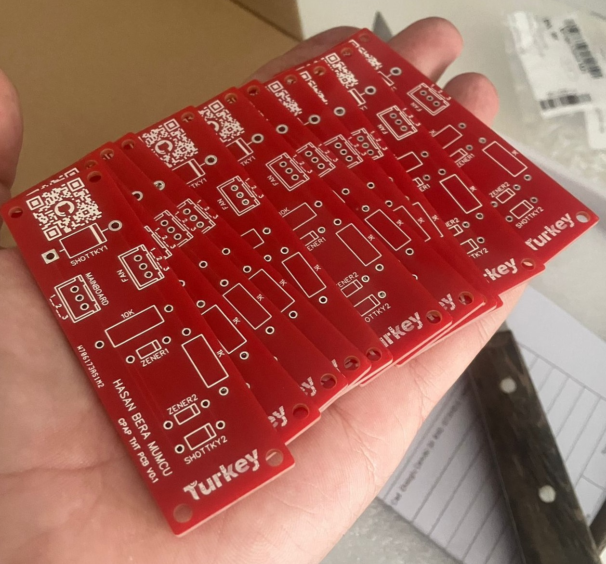
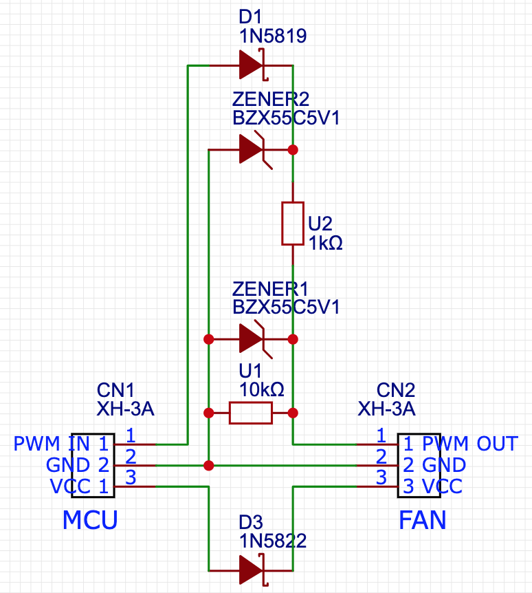

[Quick order from PCBWay](https://www.pcbway.com/project/shareproject/Roborock_THT_PCB_9a610c98.html)

I highly recommend PCBWay for anyone in need of fast and high-quality PCB manufacturing. Their service consistently delivers excellent results, with precise fabrication and quick turnaround times.

<br>

***!!!!Keep in mind this PCB hasn't been tested yet!!!!***

<br>
<br>
 
_**Key Features:**_

-THT Components: Utilizes through-hole components, making it accessible for hobbyists and easier to solder by hand.

-Size: Matches the dimensions of the [BTT U2C](https://github.com/bigtreetech/U2C), ensuring compatibility and ease of integration.

-Ease of Assembly: Simplified assembly process compared to SMD (Surface-Mount Device) components.

-Component Availability: Parts are easier to source from local and online suppliers.

-Cost-Effective: Both the components and the overall production are more affordable.

**Background:**
The original design and schematic are from this GitHub repository: [Roborock-CPAP](https://github.com/condottab/Roborock-CPAP) by [condottab](https://github.com/condottab). While the original PCB design is in SMD format, this project provides a THT alternative to cater to users looking for a simpler and more accessible solution.

Components
| Component Name | PCS |
|-------------|--------|
| BZX55C5V1   | 2      |
| 1N5819      | 1      |
| 1N5822      | 1      |
| CF2WS-1K    | 1      |
| CF2WS-10K   | 1      |
| XH-3A       | 2      |

<!-- schematic -->
<!--

-->

<!--
Assembly Instructions
[Step-by-step instructions]
-->

**Preparing the cables:**

_MCU--->PCB_
The cable from your MCU to the PCB consists of 3 wires: PWM IN(1), GND(2), and VCC(3). You have to connect VCC(3) and GND(2) to the Hotend Outputs on your controlboard. And last but not least PWM IN(1), should be connected to the RGB/NEOPIXEL output on your controlboard.

_PCB--->FAN_
The PWM OUT(1) of the second cable needs to be connected to the second pin on the motor. The motor requires a PH2.0 4-pin connector (the PCB on the motor indicates the pin numbers). The GND(2) should be connected to the 3. pin and the VCC(3) to the 4. pin. (We do not need the 1. pin in our project.)

**Klipper Configuration:**

Add this section to your printer.cfg in Klipper 
```markdown
[fan]
#part cooling fan
pin: ### Your PWM pin
enable_pin: ### Your HE pin
hardware_pwm: True
cycle_time: 0.00004
off_below: 0.12
kick_start_time: 0.01
```

